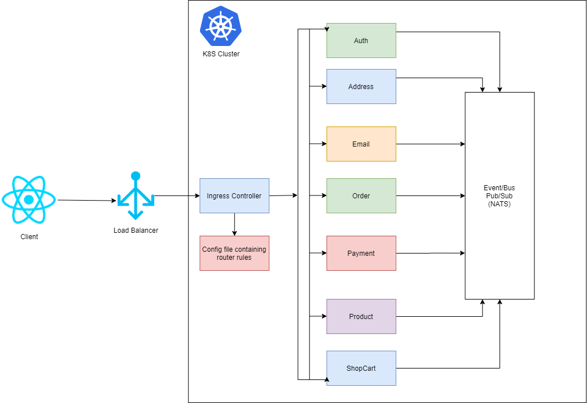

# Shopgt Microservices

This is an e-commerce web page where you can signin with your Facebook and Google account. You can buy your items with your Debit and Credit card.

### What technologies I used?

- Kubernetes https://kubernetes.io/es/
- Docker
- Nodejs + TypeScript
- (ReactJs and Redux) => TypeScript + Hooks
- Skaffold https://skaffold.dev/
- Stripe https://stripe.com/
- SendGrid https://sendgrid.com/
- S3 Aws
- Nats Streaming https://docs.nats.io/nats-streaming-concepts/intro
- PassportJs (http://www.passportjs.org/)
- Jest and Supertest (Unit Testing)

### Architecture

The following architecture consisting some services and each service has its database.

Below is a diagram of the architecture

## What I learned?

- Patterns with typescript
- Async Communication in Microservices with EventBus
- Advance NodeJs
- Patterns to create scalable microservices
- Share reusable code between multiple Express servers using custom NPM packages
- Write comprehensive tests to ensure each service works as designed
- React Hooks and Redux Hooks
- React and Redux with TypeScript

## Authors

- **Luis Sic** - _TT_ - [Sluis](https://github.com/LuisSic)

## License

This project is licensed under the MIT License - see the [LICENSE.md](LICENSE.md) file for details
